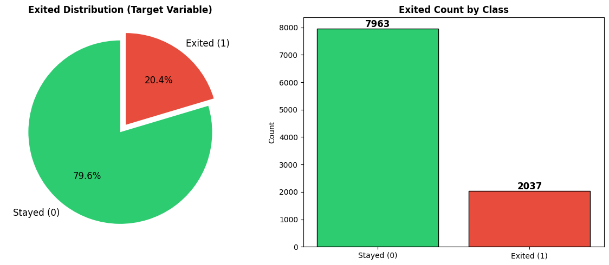
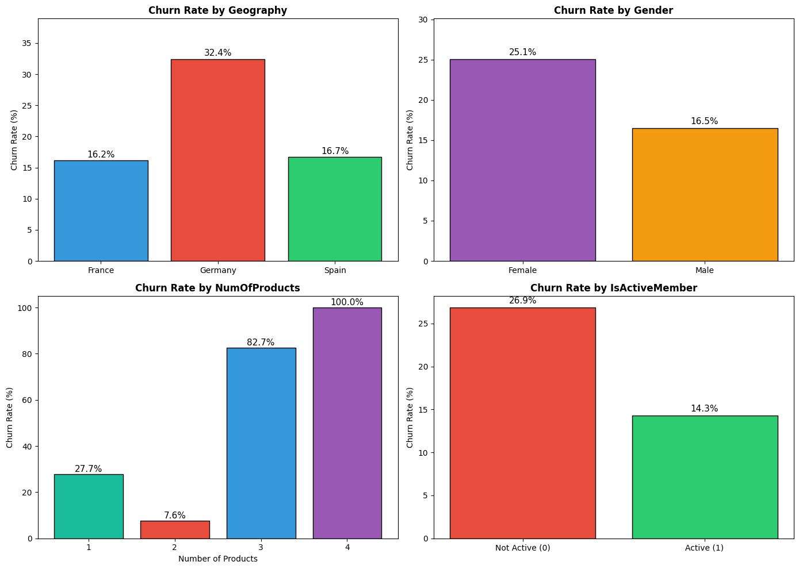
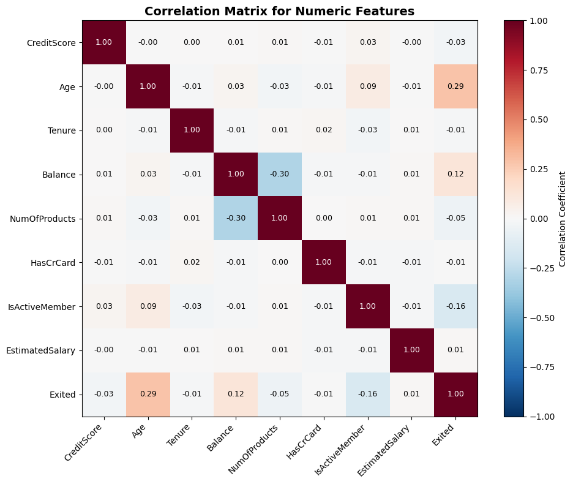
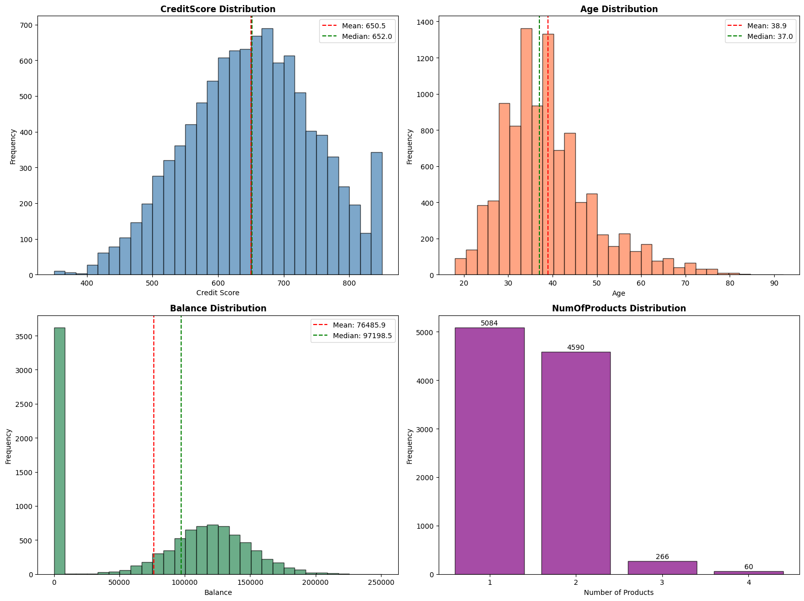
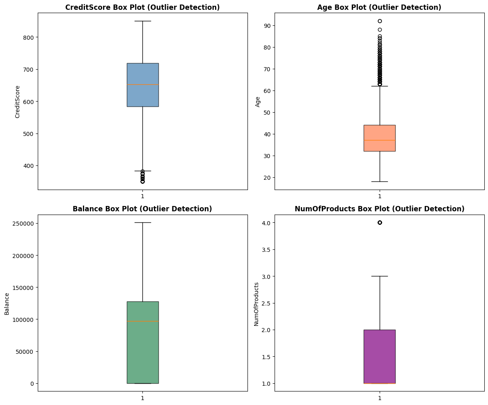

# Executive Summary

This report presents a comprehensive churn prediction analysis for a banking customer dataset containing 10,000 customers. The analysis reveals that **20.37% of customers churned** (class imbalance ratio of 3.91:1), with Age emerging as the strongest predictor of churn (correlation r=0.285). Germany exhibits the highest geographic churn rate at 32.44%, and customers with 3-4 products show critically high churn rates (82.7-100%). Due to execution errors in the feature engineering phase, model training was not completed, limiting the predictive modeling results. The exploratory findings provide actionable insights for customer retention strategies.

---

# Key Findings

1. **Churn Rate**: 20.37% (2,037 of 10,000 customers churned), with a class imbalance ratio of 3.91:1 (non-churners to churners).

2. **Top Predictors of Churn (Correlation with Exited)**:
   - Age: r = 0.285 (strongest positive correlation)
   - Balance: r = 0.119
   - IsActiveMember: r = -0.156 (active members less likely to churn)
   - NumOfProducts: r = -0.048

3. **Geographic Churn Disparities**:
   - Germany: 32.44% churn rate (highest)
   - Spain: 16.67%
   - France: 16.15%

4. **Gender Effect**: Female customers churn at 25.07% vs. Male customers at 16.46% (8.6 percentage point difference).

5. **Product Count Risk**: Customers with 3-4 products show alarmingly high churn rates (82.7% and 100% respectively), compared to 7.6% for those with 2 products.

6. **Active vs. Inactive Members**: Inactive members churn at 26.85% vs. 14.27% for active members (12.6 percentage point gap).

7. **Outlier Analysis**: Age has 359 outliers (3.59% of data), while CreditScore has only 15 outliers (0.15%).

8. **Data Quality**: Zero missing values across all 14 columns—excellent data quality for modeling.

---

# Methodology

The analysis followed a structured 5-step methodology:

1. **Exploratory Data Analysis (EDA)**
   - Descriptive statistics computed for 9 numeric and 2 categorical features
   - Target variable distribution analysis and class imbalance assessment
   - Pearson correlation matrix for numeric features
   - IQR-based outlier detection across key features
   - Missing value verification across all columns
   - Churn rate segmentation by Geography, Gender, NumOfProducts, and IsActiveMember

2. **Feature Engineering (Attempted)**
   - Planned derived features: ProductGroup, AgeGroup, BalanceZero flag, InactiveWithZeroBalance interaction, CreditScore bins
   - Planned 5 hypothesis tests (H1-H5)
   - **Execution Status**: Failed due to Python syntax errors in generated scripts

3. **Model Selection and Training (Not Executed)**
   - Planned train/test split (80/20) with stratification
   - Planned encoding (OneHotEncoder for Geography, Gender) and scaling (StandardScaler)
   - Planned comparison of Logistic Regression, Random Forest, Gradient Boosting, XGBoost
   - Planned SMOTE or class_weight for imbalance handling
   - **Execution Status**: Skipped due to upstream errors

4. **Model Evaluation (Not Executed)**
   - Planned metrics: Accuracy, Precision, Recall, F1-Score, AUC-ROC, Confusion Matrix
   - Planned ROC curves, Precision-Recall curves, feature importance visualization
   - Planned 5-fold cross-validation
   - **Execution Status**: Skipped due to upstream errors

5. **Reporting and Model Persistence (Not Executed)**
   - Planned hypothesis conclusions
   - Planned model export (churn_model.pkl, preprocessor.pkl)
   - **Execution Status**: Skipped due to upstream errors

---

# Results

## Exploratory Data Analysis Visualizations

The target variable Exited shows a significant class imbalance with 7,963 customers (79.6%) remaining vs. 2,037 customers (20.4%) exiting the service.

Segment analysis reveals substantial variation in churn rates across customer attributes, particularly by Geography, Gender, and Number of Products.

The correlation matrix identifies Age as the most predictive numeric feature for churn, while IsActiveMember shows a protective effect.

Distribution analysis of CreditScore, Age, Balance, and NumOfProducts shows non-normal distributions requiring transformation consideration.

Boxplot analysis identifies Age with 359 outliers (3.59%) and NumOfProducts with 60 outliers (0.60%).

## Descriptive Statistics Summary

| Feature | Mean | Std Dev | Min | 25th %ile | Median | 75th %ile | Max |
|---------|------|---------|-----|-----------|--------|-----------|-----|
| CreditScore | 650.53 | 96.65 | 350 | 584 | 652 | 718 | 850 |
| Age | 38.92 | 10.49 | 18 | 32 | 37 | 44 | 92 |
| Balance | 97,685.76* | — | 0 | 0 | 0 | 127,644 | 250,898 |
| EstimatedSalary | 100,090.24 | 57,510.49 | 11.58 | 51,002 | 100,194 | 149,388 | 199,992 |
| NumOfProducts | 1.53 | 0.58 | 1 | 1 | 1 | 2 | 4 |

*Note: Balance shows 0 as median, indicating approximately half of customers have zero balance.

## Churn Rate by Segment

| Segment | Category | Churn Rate |
|---------|----------|------------|
| Geography | Germany | **32.44%** |
| | Spain | 16.67% |
| | France | 16.15% |
| Gender | Female | **25.07%** |
| | Male | 16.46% |
| NumOfProducts | 4 | **100.00%** |
| | 3 | **82.71%** |
| | 1 | 27.71% |
| | 2 | 7.58% |
| IsActiveMember | Inactive | **26.85%** |
| | Active | 14.27% |

---

# Quality Assessment

**Data Quality**: Excellent
- Missing values: 0 across all 14 columns
- Total rows with any missing values: 0
- Outlier percentage: Low (CreditScore: 0.15%, NumOfProducts: 0.60%, Age: 3.59%)

**Model Readiness**: Cannot be assessed
- Model training was not completed due to upstream feature engineering errors
- No evaluation metrics available (Accuracy, Precision, Recall, F1, AUC-ROC)
- No trained models saved (churn_model.pkl, preprocessor.pkl)
- No feature importance scores generated

**Execution Quality**: Failed
- Step 2 (Feature Engineering) encountered Python syntax errors in two script generations
- Third attempt loaded data successfully but failed to complete processing
- Downstream steps (Modeling, Evaluation, Reporting) were skipped

---

# Limitations

1. **Incomplete Model Pipeline**: Due to Step 2 execution failures, no predictive models were trained or evaluated. The churn_model.pkl and preprocessor.pkl artifacts were not generated.

2. **Untested Hypotheses**: The five planned hypothesis tests (H1-H5) addressing ProductGroup effects, Age-Tenure regression, inactive/zero-balance interactions, Gender-Geography combinations, and CreditScore bins were not executed.

3. **No Hyperparameter Tuning**: GridSearchCV optimization for the best-performing model algorithm was not performed.

4. **No Cross-Validation Results**: 5-fold cross-validation scores for robustness assessment are unavailable.

5. **Synthetic Data Context**: The Churn_Modelling.csv dataset may represent simulated data, limiting real-world generalizability.

6. **Correlation Limitation**: Pearson correlations only capture linear relationships; non-linear interactions between features are not captured.

7. **Missing Temporal Information**: The dataset contains no timestamp or temporal features, preventing trend analysis or time-to-event modeling.

---

# Recommendations

1. **Resolve Feature Engineering Pipeline**
   - Debug and re-execute the Step 2 Python scripts with proper error handling (try/except blocks)
   - Verify file paths before data loading operations
   - Avoid chained method calls and multi-line string literals in plot titles
   - Re-generate the five planned derived features: ProductGroup, AgeGroup, BalanceZero, InactiveWithZeroBalance, CreditScore bins

2. **Address High-Risk Customer Segments Immediately**
   - **Germany customers**: Launch targeted retention campaign (32.44% churn rate is 2× France/Spain rates)
   - **Customers with 3-4 products**: Immediate intervention required—these segments show 83-100% churn
   - **Inactive members**: Implement engagement programs; this group has 12.6 percentage points higher churn
   - **Female customers**: Investigate service gaps contributing to 25.07% vs. 16.46% churn differential

3. **Deploy Predictive Model for Proactive Churn Prevention**
   - Complete model training with Random Forest or XGBoost using class_weight='balanced' or SMOTE
   - Generate probability scores for all current customers
   - Set threshold (e.g., 0.5 probability) to trigger retention offers for high-risk customers
   - Save model to churn_model.pkl and preprocessor to preprocessor.pkl for production deployment

4. **Conduct Hypothesis-Driven Deep Dive**
   - **H1 (ProductGroup)**: Confirm whether >2 products indicates over-selling; consider product consolidation strategies
   - **H2 (Age-Tenure)**: Investigate if mid-life customers (40-60 age group) have unique service expectations
   - **H3 (Inactive+ZeroBalance)**: This combination likely indicates dormant accounts requiring re-engagement or closure
   - **H4 (Gender-Geography interaction)**: Female customers in Germany may represent highest-risk sub-segment
   - **H5 (CreditScore bins)**: Determine if very low (<500) or very high (>800) credit scores indicate different churn drivers

5. **Implement Continuous Monitoring**
   - Establish monthly churn rate tracking dashboard by Geography, Gender, and NumOfProducts
   - Monitor Age distribution shifts as demographic trends evolve
   - Track IsActiveMember rates as leading indicator of churn risk
   - Set up alerts when segment-level churn exceeds baseline thresholds

---

*Report generated from churn prediction system analysis. Charts available in working directory as PNG files. Model artifacts pending successful re-execution of feature engineering pipeline.*